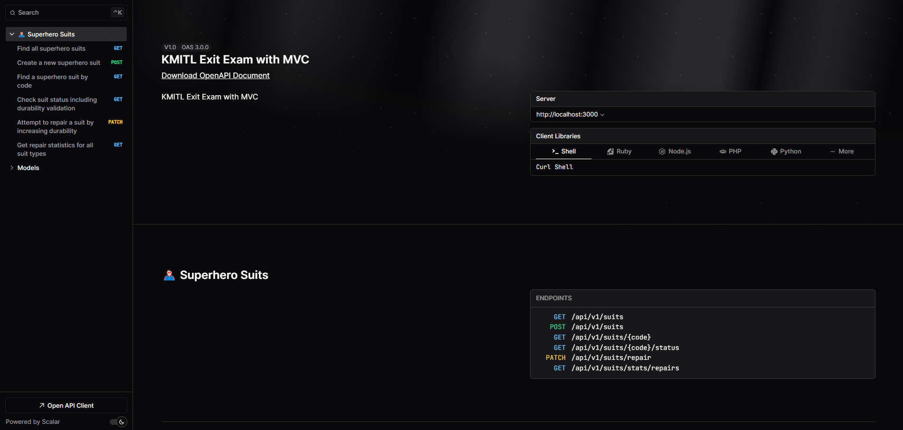

# 🦸🏻 Super Hero Suit Management System (KMITL Exit Exam with MVC Pattern)



## 🩻 Technologies Stack

- 💪 TypeScript - Safer, more readable, and more maintainable code
- 🐈 NestJS - A progressive Node.js framework for building efficient, reliable, and scalable server-side applications
- 🐶 Prisma ORM - A modern database toolkit for TypeScript & Node.js that is used to interact with the database
- 🐘 PostgreSQL - A powerful, open-source object-relational database system
- 💅 Prettier - An opinionated code formatter
- 🧹 ESLint - A tool for identifying and reporting on patterns found in ECMAScript/JavaScript code
- 🍞 Bun - A fast JavaScript/TypeScript runtime
- 🦢 Swagger - An open-source software framework backed by a large ecosystem of tools that helps developers design, build, document, and consume RESTful web services
- 🔮 Scalars - A API reference to over Swagger UI

## 📦 Project Structure

This project follows the **MVC (Model-View-Controller)** design pattern with clear separation of responsibilities:

### 🏗️ Model Layer

- **`db/schema.prisma`**  
  Defines the data structure for superhero suits, including suit ID, type, and durability level.
- **`libs/interfaces/suit-validation.interface.ts`**  
  Specifies interfaces for validating each type of suit.
- **`libs/validators/suit-durability.validator.ts`**  
  Contains the logic to validate the durability of each suit type based on predefined conditions.

### 👀 View Layer (API Endpoints)

- **`src/superhero-suit/superhero-suit.controller.ts`**  
  Manages data exchange through API endpoints for handling superhero suit operations.
- **`src/superhero-suit/superhero-suit.dto.ts`**  
  Specifies the data transfer format for input and output via the API.

### 🎮 Service Layer (Business Logic)

- **`src/superhero-suit/superhero-suit.service.ts`**  
  Implements the business logic for creating, validating, and repairing superhero suits.
- **`src/superhero-suit/superhero-suit.module.ts`**  
  Connects and organizes the different components within the superhero suit module.

### 🛠️ Infrastructure Layer

- **`libs/prisma/prisma.service.ts`**  
  Manages the database connections using Prisma.
- **`libs/decorators/catch-prisma.decorator.ts`**  
  Handles errors that occur during database operations.

### 🌱 Data Seeding

- **`db/seed.ts`**  
  Generates sample data for superhero suits.  
  _Requirement: At least 50 total suits, with a minimum of 10 suits per suit type._

## 🧢 How To Use

1. Clone this repository

```bash
git clone git@github.com:PunGrumpy/kmitl-mvc.git
```

2. Install dependencies

```bash
bun install
```

3. Run the development server

```bash
bun dev
```

4. Open [http://localhost:3000](http://localhost:3000) and [http://localhost:3000/docs](http://localhost:3000/docs) with your browser to see the result.

## 📚 API Documentation

## 🙏 Reference

- [NestJS](https://nestjs.com/)
- [Prisma](https://www.prisma.io/)
- [PostgreSQL](https://www.postgresql.org/)
- [Prettier](https://prettier.io/)
- [ESLint](https://eslint.org/)
- [Bun](https://bun.sh/)
- [Swagger](https://swagger.io/)
- [Scalars](https://github.com/scalar/scalar/)
- [TypeScript](https://www.typescriptlang.org/)

## 📝 License

This project is licensed under the **MIT License** - see the [LICENSE](LICENSE) file for details.
